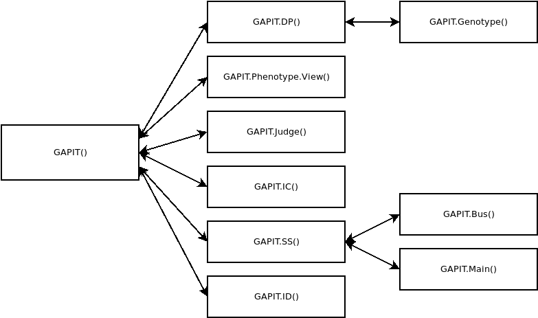

```{r setup, include = FALSE}
knitr::opts_chunk$set(echo = TRUE)
```


```{r flow, echo = FALSE, fig.cap = "A caption", out.width = '80%'}

```


## GAPIT()

#Object: To perform GWAS and GPS (Genomic Prediction/Selection)    
#Designed by Zhiwu Zhang    
#Writen by Jiabo Wang    

#'
#' perform GWAS and GPS    
#'    
#'    
#'    
#’ @param Y a sample (row) by phenotype (column) data.frame    
#’ @param G = NULL genotypes in HapMap format    
#’ @param GD = NULL genotypes in numeric format    
#’ @param GM = NULL genotype map for genotypes in numeric format (GD)    
#’ @param KI = NULL kinship data.frame (sample by sample matrix)    
#’ @param Z = NULL    
#’ @param CV = NULL covariate valiables    
#' @param CV.Inheritance = NULL    
#' @param GP = NULL    
#' @param GK = NULL    
#' @param testY = NULL    
#’ @param kinship.algorithm = “Zhang”    
#'    
#'    
#'    
#' @return out    
#'    
#' A list containing the following elements.  
#'
#' GD a data.frame containing genotypes in numeric format
#' GM a data.frame containing a genotype map
#' G a data.frame containing genotypes in hapmap format
#' kinship a data.frame containing a kinship matrix
#' chor_taxa a character vector
#'


```{r}
`GAPIT` <- function(
  Y = NULL,
  G = NULL,
  GD = NULL,
  GM = NULL,
  KI = NULL,
  Z = NULL,
  CV = NULL,
  CV.Inheritance = NULL,
  GP = NULL,
  GK = NULL,
  testY = NULL,
  group.from = 1000000,
  group.to = 1000000,
  group.by = 20,
  DPP = 100000,
  kinship.cluster = "average",
  kinship.group = 'Mean',
  kinship.algorithm = "VanRaden",
  buspred = FALSE,
  lmpred = FALSE,
  FDRcut = FALSE,
  bin.from = 10000,
  bin.to = 10000,
  bin.by = 10000,
  inclosure.from = 10,
  inclosure.to = 10,
  inclosure.by = 10,
  SNP.P3D = TRUE,
  SNP.effect = "Add",
  SNP.impute = "Middle",
  PCA.total = 0,
  SNP.fraction = 1,
  seed = NULL,
  BINS = 20,
  SNP.test = TRUE,
  SNP.MAF = 0,
  FDR.Rate = 1,
  SNP.FDR = 1,
  SNP.permutation = FALSE,
  SNP.CV = NULL,
  SNP.robust = "GLM",
  file.from = 1,
  file.to = 1,
  file.total = NULL,
  file.fragment = 99999,
  file.path = NULL,
  file.G = NULL,
  file.Ext.G = NULL,
  file.GD = NULL,
  file.GM = NULL,
  file.Ext.GD = NULL,
  file.Ext.GM = NULL,
  ngrid = 100,
  llim = -10,
  ulim = 10,
  esp = 1e-10,
  LD.chromosome = NULL,
  LD.location = NULL,
  LD.range = NULL,
  PCA.col = NULL,
  PCA.3d = FALSE,
  NJtree.group = NULL,
  NJtree.type = c("fan","unrooted"),
  sangwich.top = NULL,
  sangwich.bottom = NULL,
  QC = TRUE,
  GTindex = NULL,
  LD = 0.1,
  plot.bin = 10^5,
  file.output = TRUE,
  cutOff = 0.05,
  Model.selection = FALSE,
  output.numerical = FALSE,
  output.hapmap = FALSE,
  Create.indicator = FALSE,
  Multi_iter = FALSE,
  num_regwas = 10,
  opt = "extBIC",
  QTN = NULL,
  QTN.round = 1,
  QTN.limit = 0,
  QTN.update = TRUE,
  QTN.method = "Penalty",
  Major.allele.zero = FALSE,
  Random.model = FALSE,
  method.GLM = "FarmCPU.LM",
  method.sub = "reward",
  method.sub.final = "reward",
  method.bin = "static",
  bin.size = c(1000000),
  bin.selection = c(10,20,50,100,200,500,1000),
  memo = NULL,
  Prior = NULL,
  ncpus = 1,
  maxLoop = 3,
  threshold.output = .01,
  Inter.Plot = FALSE,
  Inter.type = c("m","q"),
  WS = c(1e0,1e3,1e4,1e5,1e6,1e7),
  alpha = c(.01,.05,.1,.2,.3,.4,.5,.6,.7,.8,.9,1),
  maxOut = 100,
  QTN.position = NULL,CG = NULL,
  converge = 1,
  iteration.output = FALSE,
  acceleration = 0,
  iteration.method = "accum",
  PCA.View.output = TRUE,
  Geno.View.output = TRUE,
  plot.style = "Oceanic",
  SUPER_GD = NULL,
  SUPER_GS = FALSE,
  h2 = NULL,
  NQTN = NULL,
  QTNDist = "normal",
  effectunit = 1,
  category = 1,
  r = 0.25,
  cveff = NULL,
  a2 = 0,
  adim = 2,
  Multiple_analysis = FALSE,
  model = "MLM",
  Para = NULL
                ){
#Object: To perform GWAS and GPS (Genomic Prediction/Selection)
#Designed by Zhiwu Zhang
#Writen by Jiabo Wang
#Last update: Novenber 3, 2016
##############################################################################################
#print("--------------------- Welcome to GAPIT ----------------------------")
#echo = TRUE
#all.memo = NULL

}


```


## GAPIT.DP()


```{r}
`GAPIT.DP` <- function(
  G = NULL,
  GD = NULL,
  GM = NULL,
  KI = NULL,
  Z = NULL,
  CV = NULL,
  CV.Inheritance = NULL,
  GP = NULL,
  GK = NULL,
  group.from = 30,
  group.to = 1000000,
  group.by = 10,
  DPP = 100000,
  kinship.cluster = "average",
  kinship.group = 'Mean',
  kinship.algorithm = "VanRaden",
  bin.from = 10000,bin.to = 10000,bin.by = 10000,
  inclosure.from = 10,inclosure.to = 10,inclosure.by = 10,
  SNP.P3D = TRUE,
  SNP.effect = "Add",
  SNP.impute = "Middle",
  PCA.total = 0,
  SNP.fraction = 1,
  seed = 123,
  BINS = 20,
  SNP.test = TRUE,
  SNP.MAF = 0,
  FDR.Rate = 1,
  SNP.FDR = 1,
  SNP.permutation = FALSE,
  SNP.CV = NULL,
  SNP.robust = "GLM",
  NJtree.group = NULL,
  NJtree.type = c("fan","unrooted"),
  plot.bin = 10^6,
  PCA.col = NULL, PCA.3d = FALSE,
  file.from = 1, file.to = 1, file.total = NULL,
  file.fragment = 99999,file.path = NULL,
  Inter.Plot = FALSE,Inter.type = c("m","q"),
  file.G = NULL, file.Ext.G = NULL,file.GD = NULL,
  file.GM = NULL, file.Ext.GD = NULL,file.Ext.GM = NULL,
  ngrid = 100, llim = -10, ulim = 10, esp = 1e-10,
  Multi_iter = FALSE,num_regwas = 10,FDRcut = FALSE,
  LD.chromosome = NULL,LD.location = NULL,LD.range = NULL,
  p.threshold = NA,QTN.threshold = 0.01,maf.threshold = 0.03,
  sangwich.top = NULL,sangwich.bottom = NULL,QC = TRUE,
  GTindex = NULL,LD = 0.1,opt = "extBIC",
  file.output = FALSE,cutOff = 0.01,
  Model.selection = FALSE,output.numerical = FALSE,
  Random.model = FALSE, output.hapmap = FALSE,
  Create.indicator = FALSE,
  QTN = NULL, QTN.round = 1, QTN.limit = 0, QTN.update = TRUE,
  QTN.method = "Penalty", Major.allele.zero = FALSE,
  method.GLM = "fast.lm", method.sub = "reward",
  method.sub.final = "reward",
  method.bin = "static",
  bin.size = c(1000000),
  bin.selection = c(10,20,50,100,200,500,1000),
  memo = "", Prior = NULL, ncpus = 1, maxLoop = 3,
  threshold.output = .01,
  WS = c(1e0,1e3,1e4,1e5,1e6,1e7),
  alpha = c(.01,.05,.1,.2,.3,.4,.5,.6,.7,.8,.9,1),
  maxOut = 100,
  QTN.position = NULL,
  converge = 1,
  iteration.output = FALSE,
  acceleration = 0,
  iteration.method = "accum",
  PCA.View.output = TRUE,
  Geno.View.output = TRUE,
  plot.style = "Oceanic",
  SUPER_GD = NULL,SUPER_GS = FALSE,
  CG = NULL,model = "MLM"){
#Object: To Data and Parameters  
#Designed by Zhiwu Zhang
#Writen by Jiabo Wang
}

# return(
#   list(
#     Y = NULL,
#     G = G,GD = GD,GM = GI,KI = KI,Z = Z,CV = CV,
#     CV.Inheritance = CV.Inheritance,
#     GP = GP,GK = GK,PC = PC,GI = GI,
#     group.from =  group.from ,group.to =  group.to,group.by =  group.by,
#     DPP =  DPP, name.of.trait = NULL,
#     kinship.cluster =  kinship.cluster,
#     kinship.group = kinship.group,
#     kinship.algorithm = kinship.algorithm,
#     NJtree.group = NJtree.group,
#     NJtree.type = NJtree.type,
#     PCA.col = PCA.col, PCA.3d = PCA.3d,
#     bin.from =  bin.from,bin.to =  bin.to,bin.by =  bin.by,
#     inclosure.from = inclosure.from,
#     inclosure.to = inclosure.to,
#     inclosure.by = inclosure.by,
#     opt = opt,
#     SNP.P3D = SNP.P3D, SNP.effect = SNP.effect,
#     SNP.impute = SNP.impute,
#     PCA.total = PCA.total,
#     SNP.fraction = SNP.fraction,
#     seed = seed, BINS = BINS,SNP.test = SNP.test,
#     SNP.MAF = SNP.MAF, FDR.Rate = FDR.Rate,
#     SNP.FDR = SNP.FDR,
#     SNP.permutation = SNP.permutation,
#     SNP.CV = SNP.CV, SNP.robust = SNP.robust, file.from = file.from,
#     file.to = file.to, file.total = file.total,
#     file.fragment = file.fragment, file.path =  file.path,
#     file.G = file.G, file.Ext.G = file.Ext.G,
#     file.GD = file.GD,
#     file.GM = file.GM,
#     file.Ext.GD = file.Ext.GD,
#     file.Ext.GM = file.Ext.GM,
#     ngrid = ngrid,
#     llim = llim, ulim = ulim,
#     esp = esp, Inter.Plot = Inter.Plot,
#     Inter.type = Inter.type,
#     LD.chromosome = LD.chromosome, LD.location = LD.location,
#     LD.range = LD.range,
#     Multi_iter = Multi_iter,
#     sangwich.top = sangwich.top,
#     sangwich.bottom = sangwich.bottom,
#     QC = QC,GTindex = GTindex, LD = LD, GT = GT,
#     file.output =  file.output,cutOff = cutOff,
#     Model.selection = Model.selection,
#     output.numerical = output.numerical,
#     output.hapmap = output.hapmap,
#     Create.indicator = Create.indicator,
#     Random.model = Random.model,
# 		QTN = QTN, QTN.round = QTN.round, QTN.limit = QTN.limit,
# 		QTN.update = QTN.update, QTN.method = QTN.method,
# 		Major.allele.zero = Major.allele.zero,
#     method.GLM = method.GLM, method.sub = method.sub,
# 		method.sub.final = method.sub.final,
#     method.bin = method.bin, bin.size = bin.size,
# 		bin.selection = bin.selection, FDRcut = FDRcut,
# 		memo = memo, Prior = Prior, ncpus = 1,
# 		maxLoop = maxLoop,
# 		threshold.output = threshold.output,
# 		WS = WS, alpha = alpha, maxOut = maxOut,
# 		QTN.position = QTN.position, converge = 1,
# 		iteration.output = iteration.output,
# 		acceleration = 0,
#     iteration.method = iteration.method,
# 		PCA.View.output = PCA.View.output,
# 		p.threshold = p.threshold,
# 		QTN.threshold = QTN.threshold,
# 		maf.threshold = maf.threshold, chor_taxa = chor_taxa,
# 		num_regwas = num_regwas, Geno.View.output = Geno.View.output,
# 		plot.style = plot.style,
# 		SUPER_GD = SUPER_GD, SUPER_GS = SUPER_GS,
# 		CG = CG, plot.bin = plot.bin
#     )
#   )

```


## GAPIT.Genotype()
#'    
#' Description    
#'     
#' @param G = NULL    
#' @param GD = NULL    
#' @param GM = NULL    
#' @param KI = NULL    
#' @param kinship.algorithm = "Zhang"    
#' @param SNP.effect = "Add"    
#' @param SNP.impute = "Middle"    
#' @param PCA.total = 0    
#' @param PCA.col = NULL    
#' @param PCA.3d = PCA.3d    
#' @param seed = 123    
#' @param SNP.fraction  = 1    
#' @param file.path = NULL    
#' @param file.from = NULL    
#' @param file.to = NULL    
#' @param file.total = NULL    
#' @param file.fragment = 1000    
#' @param SNP.test = TRUE    
#' @param file.G  = NULL    
#' @param file.Ext.G  = NULL    
#' @param file.GD = NULL    
#' @param file.Ext.GD = NULL    
#' @param file.GM = NULL    
#' @param file.Ext.GM = NULL    
#' @param SNP.MAF = 0.05    
#' @param FDR.Rate = 0.05    
#' @param SNP.FDR = 1    
#' @param Timmer = NULL    
#' @param Memory = NULL    
#' @param LD.chromosome = NULL    
#' @param LD.location = NULL    
#' @param LD.range = NULL    
#' @param SNP.CV = NULL    
#' @param GP = NULL    
#' @param GK = NULL    
#' @param GTindex = NULL    
#' @param bin.size = 1000    
#' @param inclosure.size = 100    
#' @param sangwich.top = NULL    
#' @param sangwich.bottom = NULL    
#' @param file.output = TRUE    
#' @param kinship.cluster = "average"    
#' @param NJtree.group = NULL    
#' @param NJtree.type = c("fan","unrooted")    
#' @param Create.indicator = FALSE    
#' @param Major.allele.zero = FALSE    
#' @param Geno.View.output = TRUE    
#'    
#'    
#' @return a list consisting of the following elements.    
#"    
#'    
#'    
#'    
G = G    
GD = GD    
GI = GI    
GT = GT    
hasGenotype = hasGenotype    
genoFormat = genoFormat KI = KI    
PC = PC    
byFile = byFile    
fullGD = fullGD    
Timmer = Timmer    
Memory = Memory    
SNP.QTN = SNP.QTN    
chor_taxa = chor_taxa    


Details


```{r}
#Object: To unify genotype and calculate kinship and PC if required:
#       1.For G data, convert it to GD and GI
#       2.For GD and GM data, nothing change
#       3.Samling GD and create KI and PC
#       4.Go through multiple files
#       5.In any case, GD must be returned (for QC)
#Output: GD, GI, GT, KI and PC
#'
#'
#' return (list(G = G,GD = GD,GI = GI,GT = GT,hasGenotype = hasGenotype, genoFormat = genoFormat, KI = KI,PC = PC,byFile = byFile,fullGD = fullGD,Timmer = Timmer,Memory = Memory,SNP.QTN = SNP.QTN,chor_taxa = chor_taxa))
#'
#'
GAPIT.Genotype <- function(x){
  
}

```


## GAPIT.Phenotype.View()    
#'     
#' Distribution of density,Accumulation,result:a pdf of the scree plot    
#'     
#' myY = NULL    
#' traitname = "_"    
#' memo = "_"    
#'     
#'     
#' @return    
#'     a string (function creates graphics)    
#'     
#'    
```{r}
`GAPIT.Phenotype.View` <- function(myY = NULL,traitname = "_",memo = "_"){
# Object: Analysis for Phenotype data:Distribution of density,Accumulation,result:a pdf of the scree plot
# myY:Phenotype data
}
```


## GAPIT.Judge()
#'     
#' @param DP=NULL    
#'     
#'    
#' @return    
#' A list of    
#' group.to = group.to    
#' group.from = group.from    
#'    
#'    
```{r}
`GAPIT.Judge`<-
function(Y = Y,G = NULL,GD = NULL,KI = NULL,GM = NULL,group.to = group.to,group.from = group.from,sangwich.top = sangwich.top,sangwich.bottom = sangwich.bottom,kinship.algorithm = kinship.algorithm,PCA.total = PCA.total,model = "MLM",SNP.test = TRUE){
#Object: To judge Pheno and Geno data practicability
}
```


## GAPIT.IC()
#'    
#' Intermediate Components     
#'    
#'    
#' @param DP=NULL    
#'    
#'    
#'    
#' @return    
#` a list of either    
#'    
#' Y = comY       
#' GT = GT       
#' PCA = comCV       
#' K = DP\$KI       
#' GD = comGD       
#' GM = DP\$GM       
#' myallCV = CV       
#' myallGD = GD    
#'    
#' or    
#'    
#'     
#' Y = comY       
#' GT = GT       
#' PCA = comCV    
#' K = DP\$KI    
#' GD = comGD    
#' GM = DP\$GM    
#' myallCV = CV    
#' myallGD = GD    
#' myallY = Y    
#'    
#'    
#'    
```{r}
`GAPIT.IC` <-
function(DP = NULL){
#Object: To Intermediate Components
}
```


## GAPIT.SS()


#'    
#' Sufficient Statistics (SS) for GWAS and GS    
#'    
#'    
#' @param DP = NULL    
#' @param IC=NULL    
#' @param buspred=FALSE    
#' @param lmpred=TRUE    
#'    

#'    
#' @return    
#'    
#` a list containing    
#'    
#' GWAS=GWAS       
#'        Pred=Pred       
#'        FDR=NULL       
#'        Power=NULL       
#'        Power.Alpha=NULL       
#'        alpha=NULL       
#'        h2=h2       
#'        va=va       
#'        ve=ve       
#'        Compression=Compression       
#'        mc=mc       
#'        bc=bc       
#'        mp=mp       
#'        TV=gapitMain$TV       
#'        Timmer=Timmer       
#'        Memory=Memory    
#'    
#'    
#'    
```{r}
`GAPIT.SS` <-
function(DP = NULL,IC = NULL,buspred = FALSE,lmpred = TRUE){
#Object: To Sufficient Statistics (SS) for GWAS and GS
}
```


## GAPIT.Bus()

function is used to run multiple method, Thanks MLMM FarmCPU Blink to share program and code


#' @param Y=NULL    
#' @param CV=NULL    
#' @param Z=NULL    
#' @param GT=NULL    
#' @param KI=NULL    
#' @param GK=NULL    
#' @param GD=NULL    
#' @param GM=NULL    
#' @param WS=c(1e0,1e3,1e4,1e5,1e6,1e7)    
#' @param alpha=c(.01,.05,.1,.2,.3,.4,.5,.6,.7,.8,.9,1)    
#' @param method=NULL    
#' @param delta=NULL    
#' @param vg=NULL    
#' @param ve=NULL    
#' @param LD=0.01    
#' @param GTindex=NULL    
#' @param cutOff=0.01    
#' @param Multi_iter=FALSE    
#' @param num_regwas=10    
#' @param Random.model=FALSE    
#' @param FDRcut=FALSE    
#' @param p.threshold=NA    
#' @param QTN.threshold=0.01    
#' @param maf.threshold=0.03    
#' @param method.GLM="FarmCPU.LM"    
#' @param method.sub="reward"    
#' @param method.sub.final="reward"    
#' @param method.bin="static"    
#' @param DPP=1000000    
#' @param bin.size=c(5e5, 5e6,5e7)    
#' @param bin.selection=seq(10,100,10)    
#' @param file.output=TRUE    
#' @param opt="extBIC"    
#'    
#'    
#'    
#' @return    
#' a list consisting of the following elements    
#'    
#' GWAS=GWAS     
#' GPS=GPS     
#' REMLs=REMLs     
#' vg=vg     
#' ve=ve     
#' delta=delta     
#' GVs=GR$GVs     
#' seqQTN=seqQTN    
#'    
#'

```{r}
`GAPIT.Bus`<-
function(Y = NULL,CV = NULL,Z = NULL,GT = NULL,KI = NULL,GK = NULL,GD = NULL,GM = NULL,
         WS = c(1e0,1e3,1e4,1e5,1e6,1e7),alpha = c(.01,.05,.1,.2,.3,.4,.5,.6,.7,.8,.9,1),
         method = NULL,delta = NULL,vg = NULL,ve = NULL,LD = 0.01,GTindex = NULL,
         cutOff = 0.01,Multi_iter = FALSE,num_regwas = 10,Random.model = FALSE,FDRcut = FALSE,
         p.threshold = NA,QTN.threshold = 0.01,maf.threshold = 0.03,
         method.GLM = "FarmCPU.LM",method.sub = "reward",method.sub.final = "reward",method.bin = "static",
         DPP = 1000000,bin.size = c(5e5,5e6,5e7),bin.selection = seq(10,100,10),
		 file.output = TRUE,opt = "extBIC"){
#Object: To license data by method
#Output: Coresponding numerical value
# This function is used to run multiple method, Thanks MLMM FarmCPU Blink to share program and code.
}
```


## GAPIT.Main()

#Object: To perform GWAS and GPS (Genomic Prediction or Selection)
#Output: GWAS table (text file), QQ plot (PDF), Manhattan plot (PDF), genomic prediction (text file), and
#        genetic and residual variance components
#Authors: Zhiwu Zhang

#'    
#' perform GWAS and GP    
#'    
#' @param Y a sample (row) by phenotype (column) data.frame    
#' @param G = NULL genotypes in HapMap format    
#' @param GD = NULL genotypes in numeric format    
#' @param GM = NULL genotype map for genotypes in numeric format (GD)    
#' @param KI = NULL kinship matrix (sample by sample)     
#' @param Z = NULL    
#' @param CV = NULL covariate valiables    
#' @param CV.Inheritance = NULL    
#' @param SNP.P3D = TRUE    
#' @param GP = NULL    
#' @param GK = NULL    
#' ...    
#'


#'    
#' @return a list consisting of the following elements.    
#'      
#'     Timmer = Timmer,    
#'     Compression = Compression,    
#'     kinship.optimum = theK.back,     
#'     kinship = KI,    
#'     PC = PC,    
#'     GWAS = PWI.Filtered,    
#'     GPS = GPS,    
#'     Pred = Pred,    
#'     REMLs = Compression[count,4],    
#'     Timmer = Timmer,    
#'     Memory = Memory,    
#'     SUPER_GD = SUPER_GD,    
#'     P = ps,    
#'     effect.snp = DTS[,7],    
#'     effect.cv = p3d$effect.cv,    
#'     h2 = h2.opt,    
#'     TV = TV    
#'     
#'     
#'     


```{r}
`GAPIT.Main` <- function(
  Y,
  G = NULL,
  GD = NULL,
  GM = NULL,
  KI = NULL,
  Z = NULL,
  CV = NULL, CV.Inheritance = NULL,
  SNP.P3D = TRUE,
  GP = NULL,
  GK = NULL,
  group.from = 1000000, group.to = 1, group.by = 10,
  kinship.cluster = "average",
  kinship.group = 'Mean',
  kinship.algorithm = NULL,
  DPP = 50000,
  ngrid = 100, llin = -10, ulim = 10, esp = 1e-10,
  GAPIT3.output = TRUE,
  file.path = NULL, file.from = NULL, file.to = NULL,
  file.total = NULL, file.fragment = 512,
  file.G = NULL, file.Ext.G = NULL,
  file.GD = NULL,
  file.GM = NULL,
  file.Ext.GD = NULL,
  file.Ext.GM = NULL,
  SNP.MAF = 0, FDR.Rate = 1, SNP.FDR = 1, SNP.effect = "Add",
  SNP.impute = "Middle", PCA.total = 0,
  GAPIT.Version = GAPIT.Version,
  name.of.trait,
  GT = NULL,
  SNP.fraction = 1,
  seed = 123,
  BINS = 20,
  SNP.test = TRUE, SNP.robust = "FaST",
  LD.chromosome = NULL, LD.location = NULL, LD.range = NULL,
  model = model,
  bin.from = 10000, bin.to = 5000000, bin.by = 1000,
  inclosure.from = 10, inclosure.to = 1000, inclosure.by = 10,
  SNP.permutation = FALSE,
  SNP.CV = NULL,
  NJtree.group = NJtree.group,
  NJtree.type = NJtree.type,
  plot.bin = plot.bin,
  genoFormat = NULL,
  hasGenotype = NULL, byFile = NULL, fullGD = NULL,
  PC = NULL,
  GI = NULL,
  Timmer = NULL,
  Memory = NULL,
  sangwich.top = NULL, sangwich.bottom = NULL,
  QC = TRUE,
  GTindex = NULL, LD = 0.05,
  file.output = TRUE, cutOff = 0.05,
  Model.selection = FALSE, Create.indicator = FALSE,
	QTN = NULL, QTN.round = 1, QTN.limit = 0,
  QTN.update = TRUE, QTN.method = "Penalty",
  Major.allele.zero = FALSE,
  QTN.position = NULL,
  SUPER_GD = NULL,
  SUPER_GS = SUPER_GS,
  plot.style = "Beach",
  CG = CG,
  chor_taxa = chor_taxa){
#Object: To perform GWAS and GPS (Genomic Prediction or Selection)
#Output: GWAS table (text file), QQ plot (PDF), Manhattan plot (PDF), genomic prediction (text file), and
#        genetic and residual variance components
#Authors: Zhiwu Zhang
}


# return(
#   list(
#     Timmer = Timmer,
#     Compression = Compression,
#     kinship.optimum = theK.back,
#     kinship = KI,
#     PC = PC,
#     GWAS = PWI.Filtered,
#     GPS = GPS,
#     Pred = Pred,
#     REMLs = Compression[count,4],
#     Timmer = Timmer,
#     Memory = Memory,
#     SUPER_GD = SUPER_GD,
#     P = ps,
#     effect.snp = DTS[,7],
#     effect.cv = p3d$effect.cv,
#     h2 = h2.opt,
#     TV = TV
#     )
#   )

```


## GAPIT.ID()

Description
To Interpretation and Diagnoses

#' @param G = NULL    
#' @param GD = NULL    
#' @param GM = NULL    
#' @param KI = NULL    
#' @param kinship.algorithm = "Zhang"    
#' @param SNP.effect = "Add"    
#' @param SNP.impute = "Middle"    
#' @param PCA.total = 0    
#' @param PCA.col = NULL    
#' @param PCA.3d = PCA.3d    
#' @param seed = 123    
#' @param SNP.fraction  = 1    
#' @param file.path = NULL    
#' @param file.from = NULL    
#' @param file.to = NULL    
#' @param file.total = NULL    
#' @param file.fragment = 1000    
#' @param SNP.test = TRUE    
#' @param file.G  = NULL    
#' @param file.Ext.G  = NULL    
#' @param file.GD = NULL    
#' @param file.Ext.GD = NULL    
#' @param file.GM = NULL    
#' @param file.Ext.GM = NULL    
#' @param SNP.MAF = 0.05,    
#' @param FDR.Rate = 0.05    
#' @param SNP.FDR = 1    
#' @param Timmer = NULL    
#' @param Memory = NULL    
#' @param LD.chromosome = NULL    
#' @param LD.location = NULL    
#' @param LD.range = NULL    
#' @param SNP.CV = NULL    
#' @param GP = NULL    
#' @param GK = NULL    
#' @param GTindex = NULL    
#' @param bin.size = 1000    
#' @param inclosure.size = 100    
#' @param sangwich.top = NULL    
#' @param sangwich.bottom = NULL    
#' @param file.output = TRUE    
#' @param kinship.cluster = "average"    
#' @param NJtree.group = NULL    
#' @param NJtree.type = c("fan","unrooted")    
#' @param Create.indicator = FALSE    
#' @param Major.allele.zero = FALSE    
#' @param Geno.View.output = TRUE    
#'    
#'


#'    
#'    
#' @return a string    
#'    
#'    


#' DP = NULL,    
#' IC = NULL,    
#' SS = NULL,    
#' RS = NULL,    
#' ...    
    
    
    
    
#'    
#'    
#' Details    
#'    
#' @author Jiabo Wang.    
#'    
#'     
```{r}
`GAPIT.ID` <- function(
  DP = NULL,
  IC = NULL,
  SS = NULL,
  RS = NULL,
  cutOff = 0.01,
  DPP = 100000,
  Create.indicator = FALSE,
  FDR.Rate = 1,QTN.position = NULL,
  plot.style = "Oceanic",
  file.output = TRUE,
  SNP.MAF = 0,
  CG = NULL,
  plot.bin = 10^9 ){
#Object: To Interpretation and Diagnoses
#Designed by Zhiwu Zhang
#Writen by Jiabo Wang
}
```


